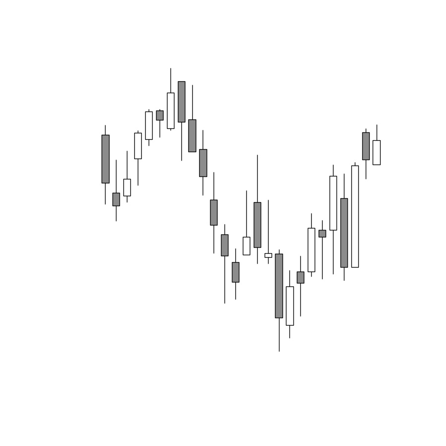
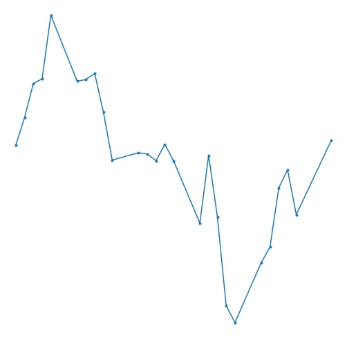

# Introduction

**This is an on-going project that is not finished. We are actively working and anticipate finishing the project in early 2022.**
  
We created a sample of financial time-series images (candlestick charts and line graphs) and developed a machine learning image classification algorithm to identify previously labeled technical indicators (e.g., RSI). This project is an open-source, approximate replication of

Naftali Cohen, Tucker Balch, & Manuela Veloso. [Trading via Image Classification](https://arxiv.org/abs/1907.10046). *arXiv preprint arXiv:1907.10046*, 2019.

## Steps

1. We retrieved the daily open, high, low, and close data on 505 firms listed in the S&P500 (see list_of_SP_500.csv in the data folder). The data ranges from 01 January 2011 to 01 January 2019. The data was retrieved from [Alpaca](https://alpaca.markets).

2. We calculated three technical indicators: [moving average convergence/divergence](https://en.wikipedia.org/wiki/MACD) (MACD), [relative strength index](https://en.wikipedia.org/wiki/Relative_strength_index) (RSI), and [Bollinger Bands](https://en.wikipedia.org/wiki/Bollinger_Bands) (BB). Each technical indicator resulted in a buy or no-buy signal for each trading day. However, we had too few buy signals for the relative strength index, so we did not consider it further.

3. For each technical indicator, we randomly sampled 20 buy and 20 no-buy signals for each ticker in the S&P 500.  

4. We created a line plot and candle stick plot for each of the randomly sampled signals. Here are some example plots (note: these examples re-sized for illustrative purposes). 

5. We created a pandas DataFrame that contained the pixel data for the grey-scaled images. We did this separately for the line plots and the candle plots.

6. We used [H2O.ai](https://www.h2o.ai) to develop machine learning algorithms. The images were classified as buy or no-buy. The model performance is evaluated and discussed.

# Prerequisites

-  [Alpaca account](https://app.alpaca.markets/signup)

-  [vscode](https://code.visualstudio.com/)

-  [docker](https://www.docker.com/)

To run this project, you will need to have an Alpaca account. Alpaca has eligibility requirements that are detailed [here](https://alpaca.markets/support/requirements-alpaca-brokerage-account/).

We developed the project using VS code and docker. These requirements ensure that you can replicate our work. However, the code can be easily modified to run on any set-up.